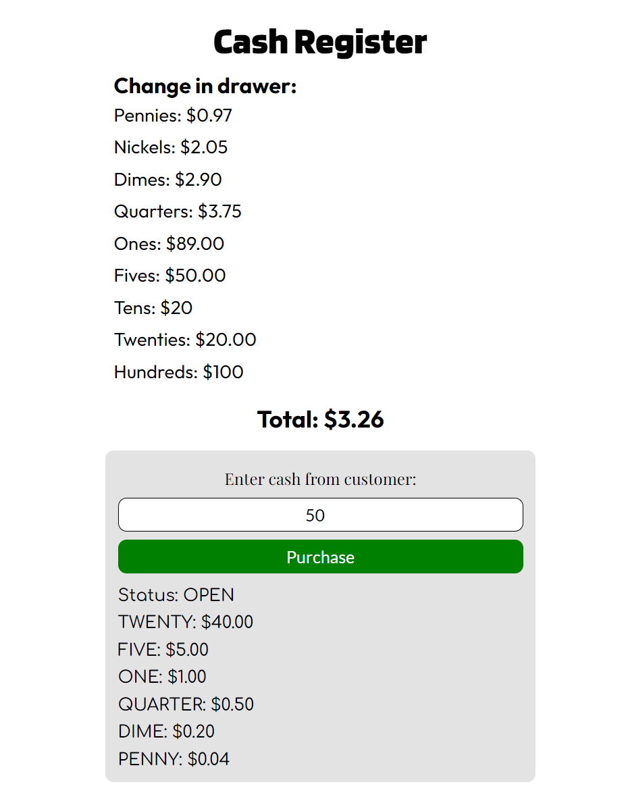

# Cash Register
 A simple program page that similates a store cash register, made for FreeCodeCamp certification Project using HTML, CSS and JavaScript
 
 The application shows different messages depending on the price of the item, the amount of cash provided by the customer, and the amount of cash in the drawer:

* **"Status: INSUFFICIENT_FUNDS"**: if *cash-in-drawer* is less than the change due, or if you cannot return the exact change.
* **"Status: CLOSED"**: if *cash-in-drawer* is equal to the change due.
* **"Status: OPEN"**: if *cash-in-drawer* is greater than the change due and you can return change, with the change due in coins and bills sorted in highest to lowest order.
 
## Page Preview
 